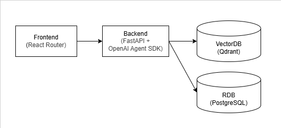
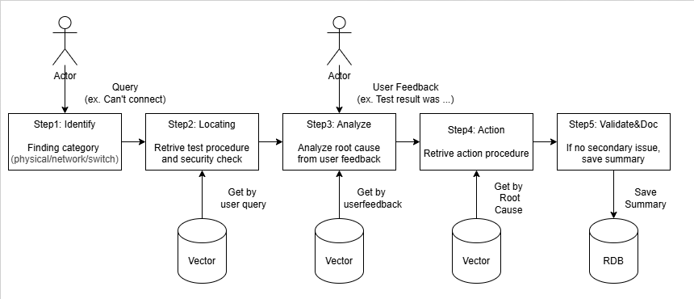
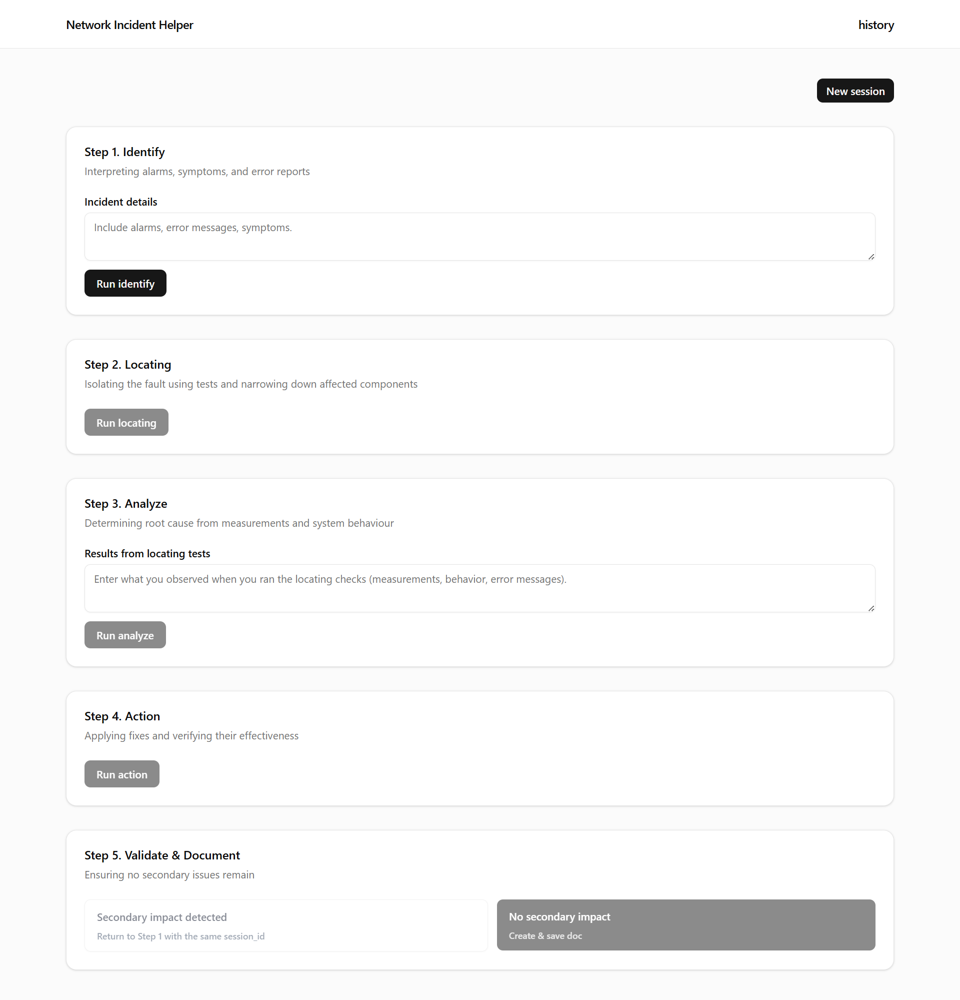
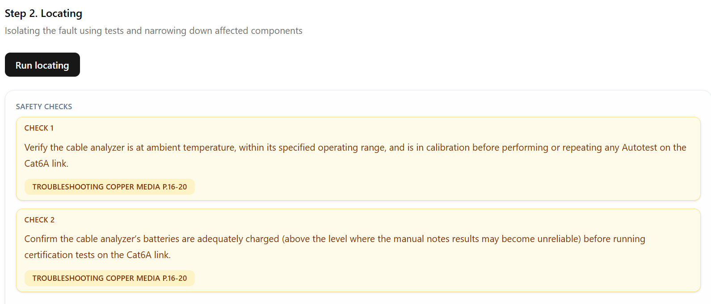
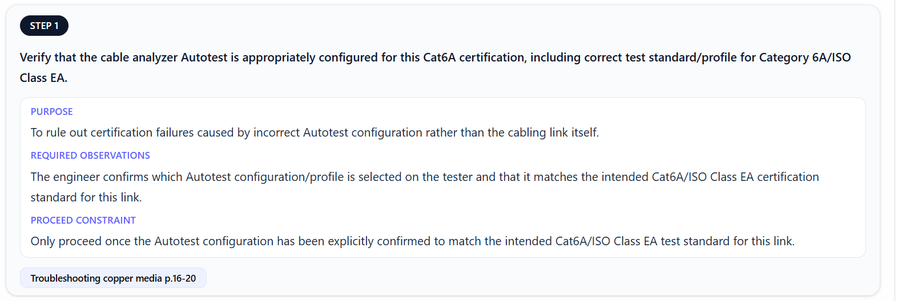
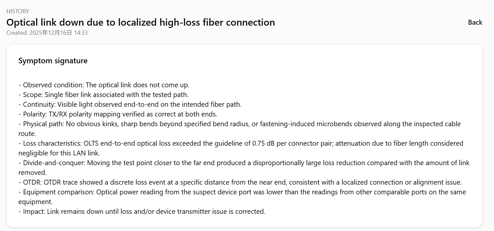

# Network Engineer Assistant

## Overview

This project implements a network troubleshooting retrieval assistant designed for network engineers.

During network incidents, engineers must follow a formal troubleshooting workflow, but the required steps are often scattered across long technical manuals.

Workflow is below:

1. Identifying the problem — interpreting alarms, symptoms, and error reports.
2. Locating the problem — isolating the fault using tests and narrowing down aAected components.
3. Analysing the problem — determining root cause from measurements and system behaviour.
4. Taking corrective action — applying fixes and verifying their eAectiveness.
5. Validating and documenting results — ensuring no secondary issues remain.

The guide also emphasizes **running tests in a logical sequence**, **verifying each step before proceeding**, and **applying strict system stability and safety precautions**. Engineers often struggle to remember which diagnostics must occur first or what checks are required before escalation. 

This system allows an engineer to input a natural-language problem description and receive structured troubleshooting steps grounded in the official guide.

The solution is based on [the Frontline LAN Troubleshooting Guide](https://assets.tequipment.net/assets/3/7/TroubleshootingGuide-FrontlineLAN.pdf) and strictly follows its prescribed diagnostic methodology.

<br>

## Approach

### Epicentor of this problem (Problem Space)

Manual is long and information is scattered. So, 
Engineers cannot instantly recall **the correct diagnostic order, safety checks and verification steps** during incidents.

### Minimum feature for MVP (Solution Space)

1. **Guiding users through the full sequence of
Identify → Locate → Analyze → Action → Validate.**

2. **Showing clearly safety checks and preconditions before execution.**

3. **Showing original manual places for transparency.**

### High Level Architecture



### High Level Sequence



### Features

#### 1. Running Identify → Locate → Analyze → Action → Validate flow using UI

- The system generates a structured troubleshooting workflow that explicitly follows the sequence.
- Each phase is clearly separated and ordered.



#### 2. Explicit Safety and Prerequisite Checks

- Identifies required safety precautions
- Highlights preconditions and environmental checks
- Ensures that prerequisite validation occurs before execution



#### 3. Manual-Grounded Step Retrieval and showing evidence for check

- All troubleshooting steps are derived directly from the official troubleshooting guide through retrieval



#### 4. Additional: Sharing troubleshoot summary and user feedback

- This is based on guidance in the troubleshooting manual, which emphasizes that past troubleshooting results should be shared.
- Also, most issues can be resolved at the user level if clear guidance is provided on what to do next time.



<br>

## Evaluation

### Evaluation Focus

This project how to evaluates whether the system follows the troubleshooting guide as written
The main criteria are:

1. Whether the response was in accordance with the documentation
2. Whether the procedures, safety measures, and prior confirmations were properly presented
3. Avoidance of undocumented or out-of-order steps

### Evaluation Approach

- These criteria are difficult to capture using numeric metrics such as RAGAS or simple LLM-as-a-judge methods.
- Ideally, evaluation would be performed by a domain expert familiar with the manual.
- So, this project uses a guide-informed ChatGPT to judge whether each response aligns with the documented procedures, safety measures, and diagnostic order.
- Due to time constraints, a simplified approach was adopted: the system executes all phases end-to-end, and the resulting outputs are evaluated collectively rather than phase by phase.

1. Create input/output of each agents

```sh
python generate_agents_csv.py
# and then, created agents_output.csv
```

2. Copy row

3. just paste to [Network Troubleshooting Output Evaluator](https://chatgpt.com/g/g-69413b7d19ac8191ae887390fd2d5bf0-network-troubleshooting-output-evaluator)

<br>

## Tech Stacks

### FrontEnd - React / React Router

| Category | tech stack | Reason |
| ---------| ---------- | -------|
| Base     | React      | This is a popular technology, so it is easy to find engineers to maintain. Also, separating from the backend allows for scalability. |
| Framework | React Router (Framework mode) | Routing and other settings are easy. There is little risk of vendor lock-in. |
| Component Library | Shadcn/ui | To unify the overall design in component files |

### Backend - FastAPI + OpenAI Agents SDK

| Category | tech stack | Reason |
| ---------| ---------- | -------|
| Framework | FastAPI | Routing and other settings are easy. There is little risk of vendor lock-in. |
| LLM Library | OpenAI Agents SDK | Considering future expansion to multi-turn. Ease of use of Conversation session. |
| Vector Search | Langchain | Well abstracted, so it can be implemented with less code. |

### DataStore - Qdrant / PostgreSQL

| Category | tech stack | Reason |
| ---------| ---------- | -------|
| VectorDB | Qdrant | It can be persisted locally and does not require Docker, making local development easy. It can be used for free for a wide range of purposes even after deployment. |
| RDB | PostgreSQL | Popular. |

<br>

## Technical Dicision / Tradeoffs

### 1. Why Execute the LLM in Multiple Phases?

- I chose **multi phase** to execute LLM this procedure.
- Because generating the entire troubleshooting flow in a single step resulted in responses where different phases were mixed together.
- In addition, it requires user input when analysis phases for next diagnosis.

**Trade-off**:
This approach increases system and eval complexity compared to a single-step response.

### 2. Why Choose the OpenAI Agents SDK?

- Preserving conversation state across llms easily.
- Considering future expansion where phases such as Identify and Locate may require multiple interaction turns. 

**Trade-off**:
Difficulty of tracing. Relying on an agent-based framework shifts more control logic closer to the LLM, which can reduce predictability.

### 3. Why chose determistic flow?

### 4. Why filter by category to retrieve vector store?

<br>

## Key learning from this

### 1. It is difficult to preserve procedural order when retrieving from long manuals.

- The troubleshooting guide is written more as a narrative document than a step-by-step instruction set.
- In this project, using filter and assigning LLM was for each phase. But, it remains a challenge.
- This reflects a realistic scenario commonly encountered in real-world development, making it a valuable learning experience.

### 2. Tradeoff of multi step LLM Execution

- To improve accuracy, I use multi-step LLM execution flow.
- While this approach improved reasoning clarity, it significantly increased the difficulty of evaluation.
- I learned the real-world trade-off between system complexity and output accuracy.

<br>

## How to run

**Install Packages**

```
python -m venv .venv
pip install -r requirements.txt

cd frontend
npm i
```

**Create Vector DB**

Run below python notebook from top code block

- scripts\insert_vector_db.ipynb

- ※: This method is for local. The method of deployment environment is not yet.
- ※: After inserting by python notebook, restart python kernel. It is because due to connection to Qdrant, application fail. 

**Create RDB**

1. After login to postgres, create database

    ```
    CREATE DATEBASE netend
    ```

2. Change env file

    Copy .env.sample to .env and rewrite your settings. 

3. Run migration

    ```
    alembic upgrade head
    ```

**Backend**

```
fastapi dev main.py
```

**Frontend**

```
cd frontend
npm run dev
```


